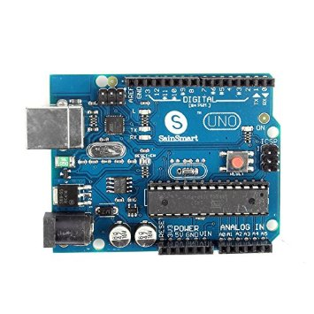
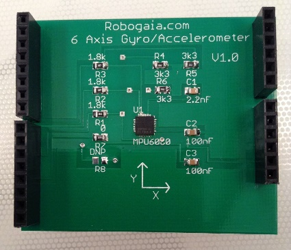
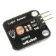
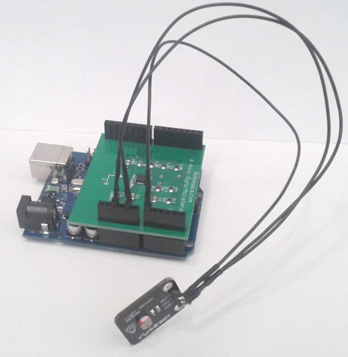

# OSVR: Sensics latency-testing hardware

Version 5.0

By Russell M. Taylor II

The Sensics latency testing hardware is constructed using an Arduino, an Arduino
gyro/accelerometer shield, and one or more photosensor inputs.

## Arduino



We built the prototype unit using an Arduino Uno-style board. The particular
board we used was the SainSmart UNO ATmega328P, which was purchased through
Amazon.com at <http://smile.amazon.com/dp/B006GX8IAY/> for $17.69.

## Gyro/accelerometer



We built the prototype unit using a 6-axis accelerometer gyro Arduino shield
module made by Robogaia.com. It was purchased through Amazon.com at
<http://smile.amazon.com/dp/B00GLCEXDG/> for $39.99 plus $4.49 shipping with an
estimated delivery time of 6-25 days. It is designed to work directly with the
Arduino Uno and can be adapted by adding wiring to work with the Arduino Mega
2560.

**Installation:** The shield plugs directly into the top of the Uno
board.

## Photosensor/Phototransistor


We built the second prototype using an IR phototransistor purchased at Radio
Shack, which also operated in the visible-light range (part number 276-0145,
$1.99). We hooked the phototransistor up according to the SHARP Optoelectronics
Photodiode/Phototransistor Application Circuit (see above). To produce voltages
that changed over a range, we used a 10kΩ resistor (R<sub>L</sub>) in series
with the phototransistor. To make the values larger for brighter light, we used
a common-collector configuration with the resistor placed between the transistor
output and ground.

**Installation:** Connect one side of resistor R<sub>L</sub> to GND on the
Arduino. Connect the collector on the phototransistor (V<sub>CC</sub>) to +5V on
the Arduino. Connect the junction between the transistor collector and resistor
(V<sub>OUT</sub>) to ANALOG IN A0 on the Arduino.

***Alternative:*** We built the first prototype, (which had slower response)
using a wRobot light sensor through Amazon.com at
<http://smile.amazon.com/dp/B00AF278A8/> for $6.99.



You need to find some jumper cables to connect the pins on the photosensors to
the pins on the Uno (actually on the shield’s pass-through connectors). For the
prototype, we bought some at Radio Shack, but you can also purchase them online.
You want make-to-female jumpers like the ones at
<http://smile.amazon.com/dp/B00D7SDDLU/> from Amazon.

**Installation:** Connect the GND pin on the light sensor to GND on the Arduino
(4th or 5th pin from the end on the first block). Connect the VCC pin on the
light sensor to 5V on the Arduino (3rd pin from the end on the first block).
Connect the OUT pin on the light sensor to ANALOG IN A0 on the Arduino (first
pin on the second block).

## Hardware testing



The fully assembled unit (using the photosensor alternative) is shown above.

To enable use viewing a head-mounted display, you will want to attach the
photosensor to the back of the unit (the bottom in the picture) with the sensor
facing away from the unit. **Important:** Place a non-conductive element between
the back of the sensor and the back of the unit, perhaps some sort of adhesive
putty. To enable viewing the latency on the screen, you will want to use long
jumper cables and put the sensor on a stand that keeps it fixed in space fairly
close to the display screen.

You can test the analog sensor by running the `print_photosensor.ino` program
that comes in the source directory with the latency tester or using the
***File/Examples/01.Basics/ReadAnalogVoltage*** Sketch program in the Arduino
interface, and watching the output on the ***Tools/Serial Monitor*** that comes
built in. Move the photosensor in front of bright and dark locations on the
screen and you should see a measurable difference in voltage (perhaps a range of
3V to 4.12V).

You can test the accelerometers and gyroscopes by running the
`print_inertial.ino` program that comes in the source directory with the latency
tester or using the `Accelerometer_Gyro_Shield_test.ino` program that you can
download from the vendor site at
<http://www.robogaia.com/6-axis-accelerometer-gyro-arduino-shield.html> in the
***Example Code*** section. Use the serial monitor to view output. As you flip
the unit over, the accelerometer readings for the Z axis should change from
negative several thousand to positive several thousand. As you rapidly rotate
the unit, you should see the gyro values change.

**Note:** the Arduino resets itself when its USB port is plugged in, at least on
a Mac and Linux. To avoid having command characters lost to the reset, any
client code that wants to communicate directly with the serial port must wait
until it has been able to read the initial messages from the device before
attempting to send the first command to it.

## Programming the Arduino

When you plug the Arduino into Linux, it is immediately recognized as a virtual
serial device and will show up in `/dev/serial/by-id` as a device with the name
Arduino_Uno in it (and may also appear as `/dev/ttyACM0`).

When you plug the Arduino into Windows 8, it does not immediately recognize it
without a driver. You can download the Arduino software from the
<http://Arduino.cc> web page. We used version 1.0.6 of the software to develop
the latency-measuring prototype. Note that the software is GPL. Be sure to
unplug your Arduino before installing the software (which includes a driver) and
then plug it in again when the software has been installed. At this point, the
device will show up as a COM port.

To load a program onto the Arduino, install the Arduino development environment
and then open the .ino file. Press the run button (right arrow in version 1.0.6)
to compile, load and run the program. There are two version of the latency
tester, a motion-onset test and a motion-turnaround test.

### Motion onset test

**Warning:** Before running this test, either turn off all room lights or shield
the sensor so that the lights are not visible. Even incandescent lights have
enough ripple in their brightness to trigger the brightness-change test, so they
can corrupt the measurements. Also, run the `print_photosensor.ino` test and
point the photodetector at a region on the screen with a constant brightness to
ensure that the printed values don’t change by more than maybe 1 count; some
displays have a flashing backlight that can also corrupt the measurements.

Sensics first developed a `motion_onset_test.ino` program to be downloaded and
run on the prototype system. This program waits for a period of no motion of the
inertial measurement unit followed by a sudden motion (acceleration and/or
rotation). It then looks for a change in brightness in the photodetector signal
and reports the duration in microseconds between the onset of motion and the
change of brightness.

To see the output from the program, open *Tools/Serial Monitor*. It should print
a version number and give instructions. Rigidly attach the photosensor near a
fixed location on the display screen or HMD. Rigidly attach the inertial
measurement system (the body of the Arduino along with its shield) to the
tracking device or mouse. Hold the tracking unit still and then move it suddenly
in a way that will cause the part of the image in front of the photosensor to
change its brightness dramatically in response to the motion. The program will
report the number of microseconds between the detection of motion and the
detection of a change it brightness. You probably want a situation where you can
repeatedly rotate or move back and forth and have the brightness transition, so
that you can get a number of measurements.

When the program runs, it first makes sure that the inertial measurement unit is
held still for half a second; during the time it is waiting for the unit to
become still, the LED will flash rapidly, looking like it is dim.

Once it has settled, it waits for a sudden motion. While it is waiting for this,
the LED will be bright.

As soon as it detects the motion, the LED goes off while it waits for the
brightness to change. If the brightness does not change for a second, it times
out and goes back to looking for the unit to be held still. If it does detect a
change, it reports the latency between the motion and the change in brightness
and goes back for waiting for the unit to be held still.

Every 16 measurements, the program computes the average latency in microseconds
for the previous 8 odd measurements, and also for the previous 8 even
measurements (to support modes where there is an on/off or back/forth test being
done). Timeouts are ignored when computing this average.

**Tweaks:** The motion and brightness thresholds are stored as constants in the
program, with names `GYRO_THRESHOLD`, `ACCEL_CHANGE_THRESHOLD`, and
`BRIGHTNESS_CHANGE_THRESHOLD`. You can adjust these as needed to provide
additional sensitivity (or more robustness in the presence of noise) and then
re-run the program. The number of delays to wait before averaging is stored in
`NUM_DELAYS` and should be twice as many as will be averaged, since there is a
separate even and odd measurement.

### Motion turn-around test

**Warning:** Before running this test, either turn off all room lights or shield
the sensor so that the lights are not visible. Even incandescent lights have
enough ripple in their brightness to trigger the brightness-change test, so they
can corrupt the measurements. Also, run the `print_photosensor.ino` test and
point the photodetector at a region on the screen with a constant brightness to
ensure that the printed values don’t change by more than maybe 1 count; some
displays have a flashing backlight that can also corrupt the measurements.

**Warning:** This test is still a work in progress and should be considered at
best alpha software.

Sensics next developed a `motion_turnaround_test.ino` program to be downloaded
and run on the prototype system. This program expects periodic rotation around
one axis, where there is a brightness change correlated to motion such that the
brightest image is present at the end of rotation in one direction and the
darkest image is present at the end of rotation in the other.

To see the output from the program, open *Tools/Serial Monitor*. It should print
a version number and give instructions.

To test latency, rigidly attach the Arduino base to the HMD whose latency is to
be tested. Then rigidly attach the photosensor so that it is looking at an image
that will get brighter as the HMD is rotated in one direction and darker as the
HMD is rotated in the other direction. The image needs to continue getting dark
and brighter over the whole range of rotation. The photodiode has a wide field
of view, so it will probably integrate brightness over the whole scene.

Smoothly but rapidly rotate the HMD repeatedly from darker to lighter and back
again. The program records the time when the axis (whichever is rotating the
most) switches direction and then records the time when the photosensor’s value
reaches its extreme value (maximum or minimum). It computes the latency in
microseconds between these two times and reports it (this report will not be
accurate to more than 1ms). It running statistics for the latencies and reports
the min, max, and mean when the HMD is held still for two seconds.

When the HMD is held still for more than two seconds, it resets its statistics.
When its rotation is started again, it re-estimates which axis it will use. This
lets you test the response for different orientation axes to see if the latency
differs. Remember that the brightness needs to vary monotonically as you rotate
around each axis that you want to test.

### Notes

The Arduino is programmed in a variation of C++ code, in what they call a
"Sketch", which is converted into C/C++ code, compiled, and then sent to the
board. When you compile and upload a program to the unit, it will continue to
run that program even if the reset button is pushed or the USB power is removed
and restored. The Sensics apps fill in the *setup()* and *loop()* functions with
the Sketch code to be run at boot time and repeatedly. Any variables that need
to persist between loop runs must be declared static.

The LED pin (pin 13) on the board is also used by the SPI communication
protocol, so it is not available to be used for signaling when SPI communication
is being used (to communicate to the gyro/accelerometer shield.

The loop() function is called about every 500 microseconds for the above two
programs, so the granularity of measurements is on the order of half a
microsecond.

## Client program

It is not necessary to run a separate client-side program to test the end-to-end
latency of an application. The Arduino serial monitor can be used to report this
latency as described above.

Sensics has also developed a specialized client-side program, named
*Latency_test*, to test the latency of various subsystems. Here is the output of
its `–help` option:

```none
Usage: C:\tmp\vs2013_64\Latency_test\Release\Latency_test.exe

        [-fullscreen]
        
        [-button vrpnDeviceName whichButton]
        
        [-analog vrpnDeviceName whichAnalog threshold]
        
        [-tracker vrpnDeviceName whichSensor translationThreshold
        rotationThreshold]
        
        [-trackerRotate vrpnDeviceName whichSensor whichAxis[0,1,2]]
        
        [-numquads num]
```

When it is run with the ‘-button’, ‘-analog’, or ‘-tracker’ options, it will
work with the motion-onset test for the hardware unit. Whenever it receives a
large-enough motion, it triggers a transition from dark to bright. The –tracker
option is given the VRPN device name (`Tracker0@localhost`), the sensor on the
tracker to watch (0), the translation threshold to use for motion (0.01 works
for a tracker like the YEI that does not report it) and the threshold for
rotation (barely large enough not to be triggered by noise or inadvertent
motion, 0.1 for the YEI tracker).

When it is run with the ‘-trackerRotate’ option, it will adjust the brightness
based on the angle of rotation one axis of a VRPN tracker. When used this way,
you should first rotate the axis further than you will be using for the test
itself, to set the maximum and minimum rotations such that the screen will not
go completely dark or completely bright during the test. Then place the
photosensor so that it can see at least a portion of the latency-test window and
oscillate the tracker back and forth around that axis.

The *Latency_test* program can also be used to measure the differential time to
render a 2D mouse cursor vs. a simple 3D scene, and (with the `–numquads`
option) to see the impact of polygon count (frame rate) on latency.

## Appendix A: Original photosensor latency testing

See Appendix D for testing done using the phototransistor.

There is a time constant associated with the photosensor that depends on the
detector. To test this latency for the particular photosensor you are using, a
`Photosensor_latency_test.ino` program has been developed. To use this program,
point the photosensor at the LED on the Arduino board and then run the program.
Open ***Tools/Serial Monitor*** on the Arduino development environment after
running the program to see what these values are.

The particular unit used in the first prototype had a fairly long time constant,
so that operating the unit with a threshold halfway between the bright and dark
value produced a latency of around 1-2ms for an LED-on event and of about
18-35ms for an LED-off event. This value depends on the ambient brightness and
the difference between bright and dark levels for the photodiode. When operating
with a threshold that is 1/10th of the way from the off value to the on value,
the on latency was 0.4ms and the off latency 1.8ms for a fairly bright ambient;
they were 0.5ms and 6ms for a dark ambient. When operating with a threshold that
is 1/20th of the way from on to off, the latencies were 0.4ms and 3ms for a dark
ambient; 0.28 and 0.7ms for a bright ambient. All of these values include a
0.14ms loop delay (how long it takes for the Arduino to read the analog value
and go once more through its loop function).

The algorithm used for latency testing uses the 1/20th of the full-scale
threshold so that the photodiode latency will be a small fraction of the total
system latency. **Note:** This photosensor should not be used for the
brightness-ramp testing due to variable delays depending on the brightness
levels being used and the speed of brightness change. For the on/off testing
with large brightness changes and sensitive thresholds, it is fine.

## Appendix B: End-to-end latency testing of motion_onset_test

We tested version 1.0.0 on the prototype by holding the alternate photosensor
and the system board together in one hand and rapidly moving the entire unit so
that the photosensor was moving out from behind an occluder and viewing a light.
When moving as suddenly as possible by hand, latencies of as low as 1ms were
observed. Latencies of as low as 2ms were observed when moving towards darker
regions. As expected from by-hand testing, the measurements were variable and
were sometimes much larger (as much as 30ms).

Adhesive putty was used to attach the photo sensor to the body of the unit and
the unit was placed on a table top near the edge of an overhang that blocked the
light. It was repeatedly tapped sharply with a fingernail to move it into the
darkness, resulting in reliably low measurements (2.8ms, 3.1ms, 1.7ms, 2.4ms,
3.7ms). The variability in the measurements may still be attributable to
variations in initial starting position and strength of tap.

When holding the unit and rotating it so that the photo sensor went into and out
of the light, slightly higher latencies (3-6ms) were observed, probably due to
the rotational inertial of the hand/Ardiuno/cord system being higher relative to
muscle strength than the translational inertia.

With the system sitting above the photosensor between it and the light, when we
tapped the system slightly so that the amount of shading increased a bit, we saw
the following latencies (ms): 23, 20, 16, 14, 23, 11, 17, 11, 12, 6 (for
varying-strength taps). For a series of strong taps with the unit positioned to
partly shadow the sensor (ms): 8.5, 9.4, 8.4, 6.9, 8.8, 7.9, 8.3.

Switching the photosensor threshold from 5 down to 3 (version 2.1.0 of the
software) produced latencies in the unit positioned to partly shadow the sensor
of (ms): 6.8, 6.2, 8.3, 7.3, 6.9, 6.9. For the fingernail-tap into the darkness
under an overhang test, the latencies were (ms): 1.0, 1.0, 1.2, 1.2, 1.1, 1.1,
0.9, 1.3, 0.8, 0.8.

## Appendix C: End-to-end latency testing of motion_turnaround_test

We tested version 1.0.0 of this program on the prototype by rigidly attaching
the alternate photosensor to the inertial unit and rotating back and forth such
the photosensor faced towards and away from a bright window.

Over 50 measurements, the minimum latency was 496 microseconds and the maximum
was 504. This latency is half of the sampling rate of the inertial sensors, and
is probably close to the iteration speed of the loop that is doing the testing.
The same results were obtained when rotating around the X and Y axis of the
unit.

## Appendix D: Phototransistor latency testing

To test this latency for the particular photosensor you are using, a
*Photosensor_latency_test.ino* program has been developed. To use this program,
point the photosensor at the LED on the Arduino board and then run the program.
Open ***Tools/Serial Monitor*** on the Arduino development environment after
running the program to see what these values are.

The phototransistor was tested with a 10kΩ resistor as R<sub>L</sub>.

### Latency tester

Using the *Photosensor_latency_test* program with on and off thresholds both set
at halfway between the brightest and darkest value, we find the on delay to be
280-390 microseconds (0.3ms) and the off delay to be around 400 microseconds
(0.4ms).

### Screen observations

Observations made using an oscilloscope, placing the scope probe across
V<sub>OUT</sub> and GND with the circuit attached to the Arduino, which was
operating the `print_photosensor` program to indicate the levels it was reading.
The response time was fast enough to capture changes in display brightness that
happened over less than 2 milliseconds (details below), indicating a response
time under 2ms. This is consistent with the results above, which indicate that
the voltage is passing the halfway mark in under half a millisecond.

**External display:** With the phototransistor attached to an LCD display
operating at 60Hz using adhesive putty looking at the display turned off, the
Arduino reported values between 6 and 7, and the scope showed around 0.1V. When
looking at a dark patch (black send to the display) with the display on, values
ranged from 5 to 39 and the scope showed an exponential-approach square-wave
from 0.1-0.4V. When looking at a bright-white patch of an LCD display with room
lights off, the Arduino was reporting values between 56 and 135. The
oscilloscope showed from 0.4-0.8V.

In the two cases with the display turned on, the oscilloscope showed an
exponential approach to a higher value that lasted about 3ms, followed by an
exponential decay back down towards a lower value that took about 1.8ms. This is
consistent with the display using an illuminator that cycles on and off at about
500 Hz.

When the brightness changes on the display, there is an envelope of brightness
that goes exponentially from the first brightness level to the second, with a
time constant of around 10ms. This is consistent with a display response time of
around 10ms.

**Laptop display:** With the phototransistor pointed at a bright patch on the
laptop display (also operating at 60Hz), the Arduino reported a steady value of
180 and the oscilloscope showed a steady 0.9V. When toggling the brightness on
the screen from full black to full bright, the oscilloscope shows an exponential
approach to the bright value or dark value with a time constant of approximately
10ms. This is consistent with a display response time of around 10ms.

## Appendix E: End-to-end latency testing of motion_turnaround_test

We tested version 1.1.0 of this program on the prototype by rigidly attaching
the phototransistor to the inertial unit and rotating back and forth such the
photosensor faced towards and away from a bright patch on the screen (and onto
the black laptop bevel).

Over 50 measurements, the minimum latency was 496 microseconds and the maximum
was 504. This latency is half of the sampling rate of the inertial sensors, and
is probably close to the iteration speed of the loop that is doing the testing.
The same results were obtained when rotating around the X and Y axis of the
unit.

Sometimes the unit reports latencies of 4-6ms during these tests. Runs where
this occurs should be discounted, but it is disconcerting because this might
presumably also happen during an actual run.
